### NOTE: **we will be working in AWS region N.Verginia _us-east-1_ at top right cornor.**

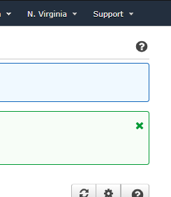

## Elastic BeanStalk

1. Create _New Application_.

   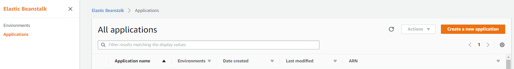

2. Fill Application Name.
3. Tag in optional.
4. Click _create_.
   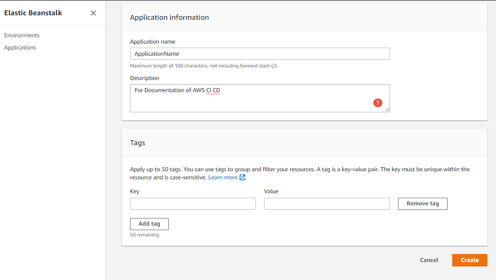

5. Now Create an environment inside your newly created Application.

   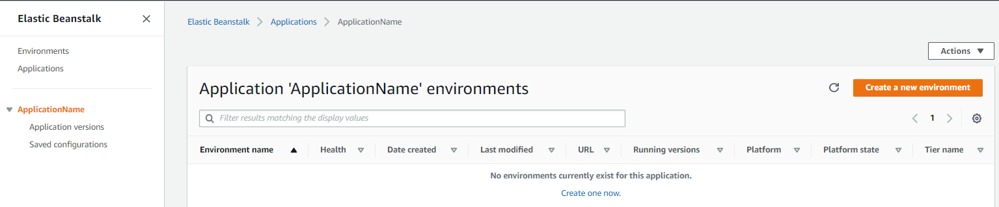

6. Choose _web server environment_.
7. click _Select_.

   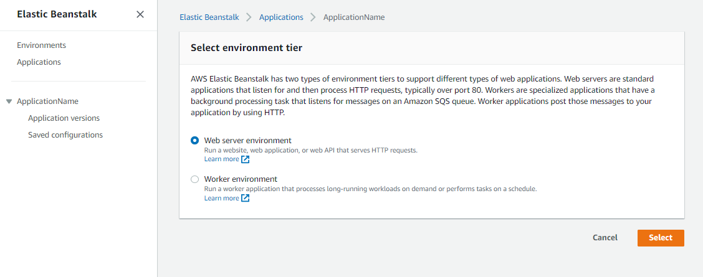

8. Application name and Environment name will automatically get filled but you should recheck. **Are these the right resourses?**
9. Domain and description is _optional_ fields.

   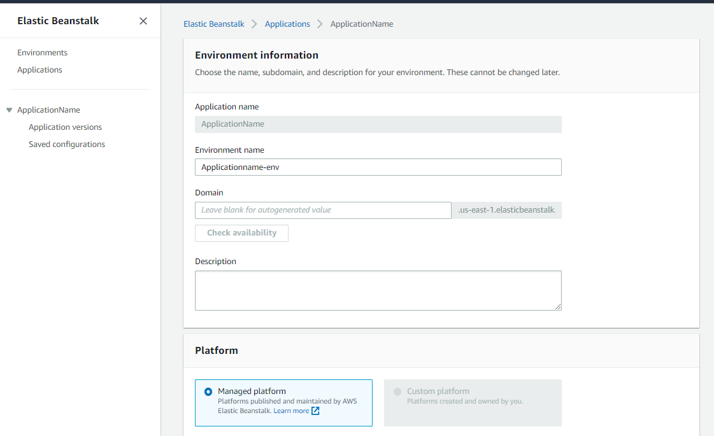

10. Our application is _Node.js_.
11. Application code _Sample application_.
12. Click _Create environment_.

    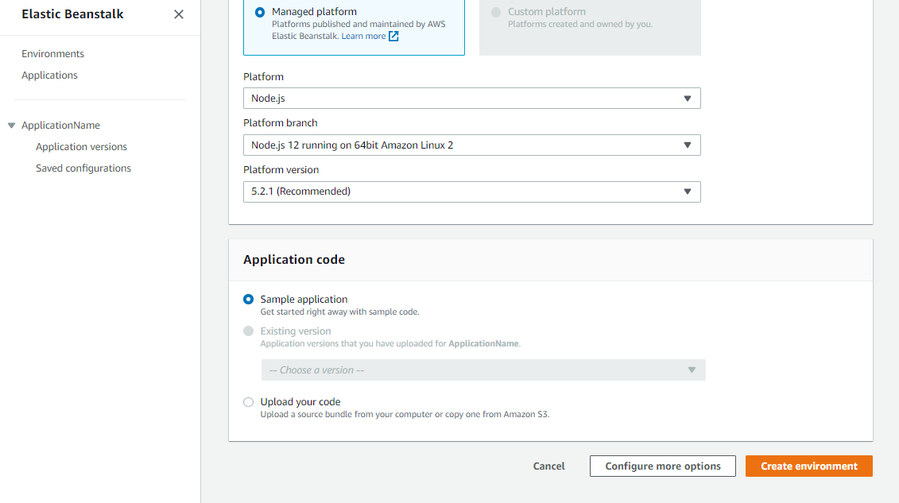

13. After 5-10 mints our _environment will be created_.

    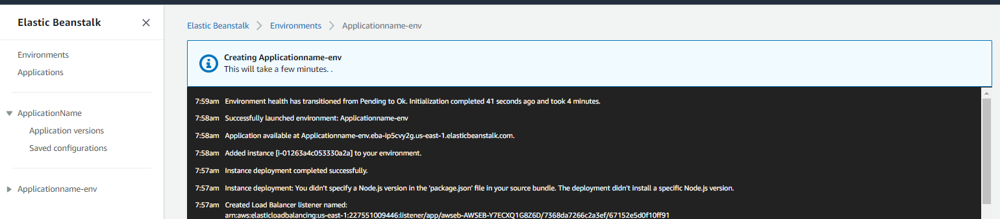

14. After Completion visit the provided url under **Application-env** for confirmation but it is not necassary.

    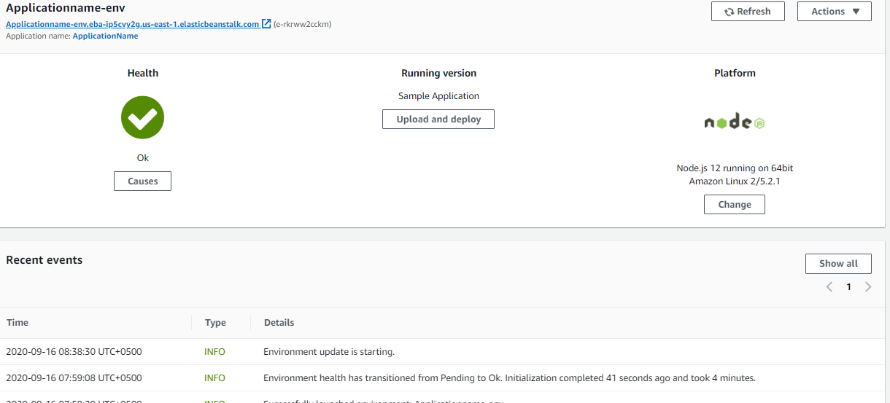

## AWS Pipeline

1. Create New Pipeline.
2. Click on _Getting Started_.

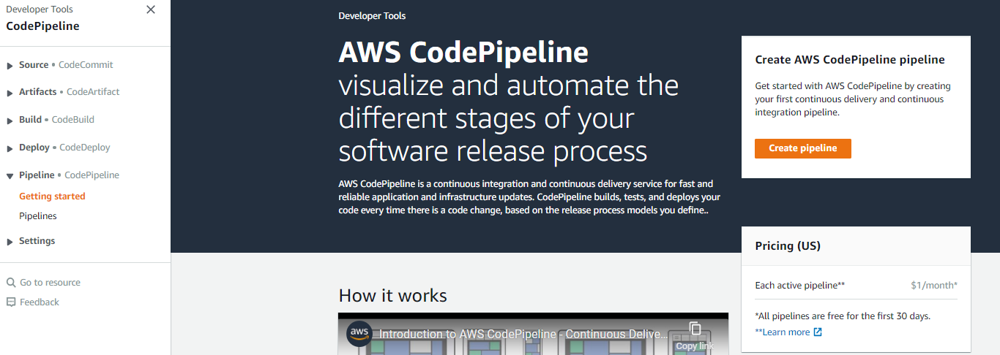

3. Write Project Name whatever you like.
4. You can leave other options blank. They are optional.
5. Click _next_.

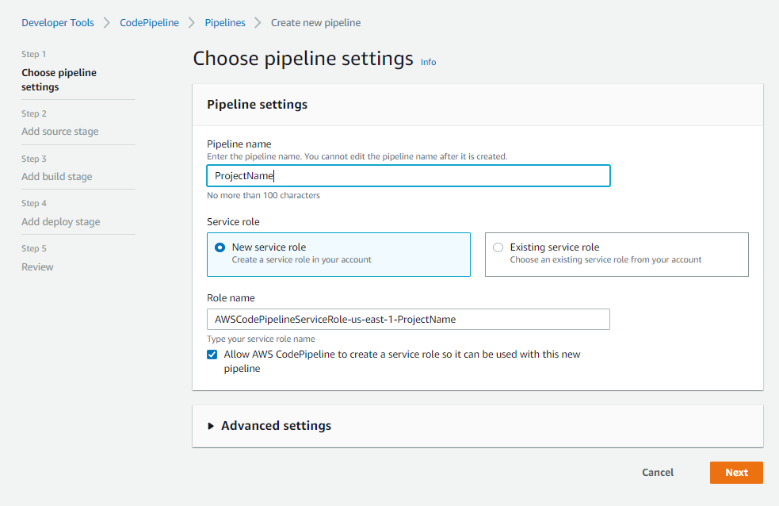

6. Here you have to choose where does your code exit. _Github, Bitbucket_ or _AWS Code Commit_.
7. Connect your profile to your Source provider (May be github).
8. Choose the repo branch you want to use for online production.
9. Click _next_.

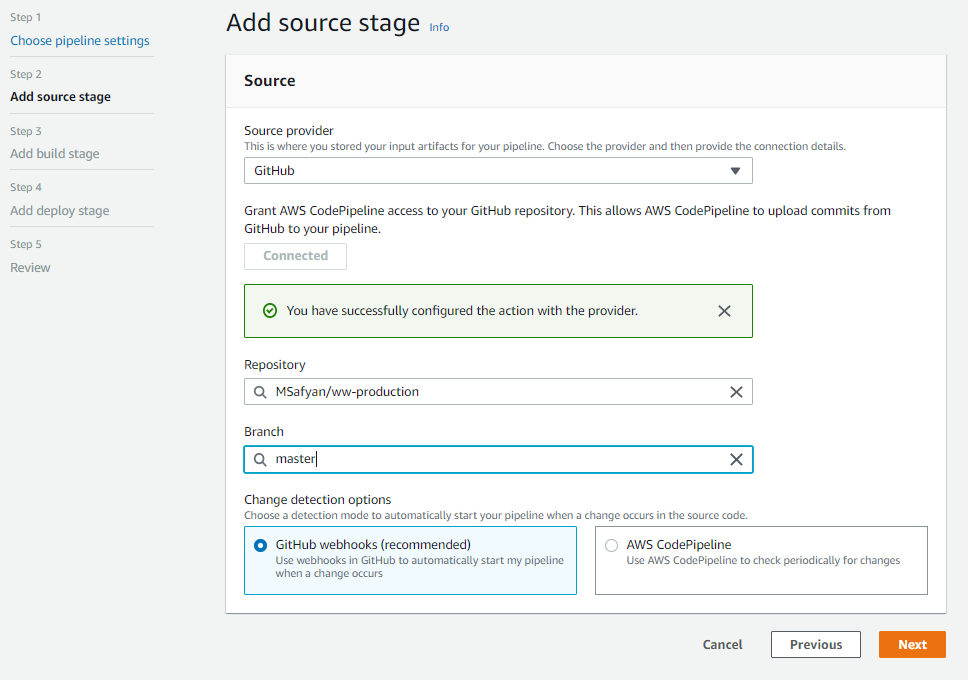

10. Skip _build Stage_ for simplicity.

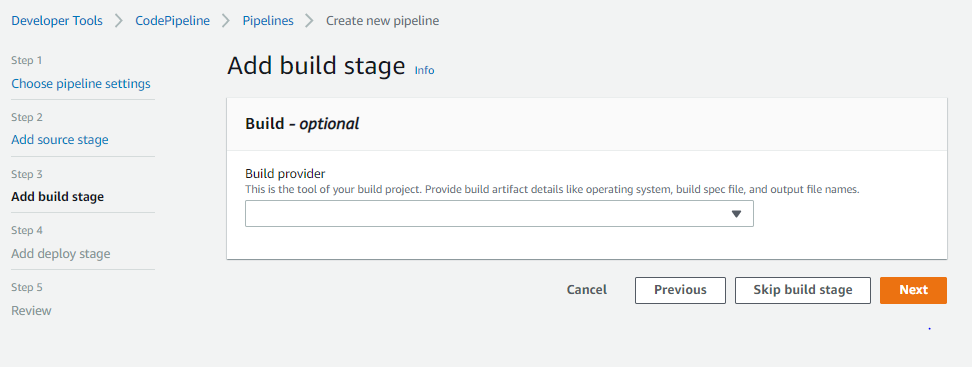

11. Now choose _AWS Elastic Beanstalk_.
12. Carefully choose AWS region while creating resourses. We will create Application in virginia.
13. if you dont have _new Beanstalk Application and Environment_ create them but we have already completed this step.

14. Select _Application Name and Environment name_ form the drop down.
15. Click _next_.

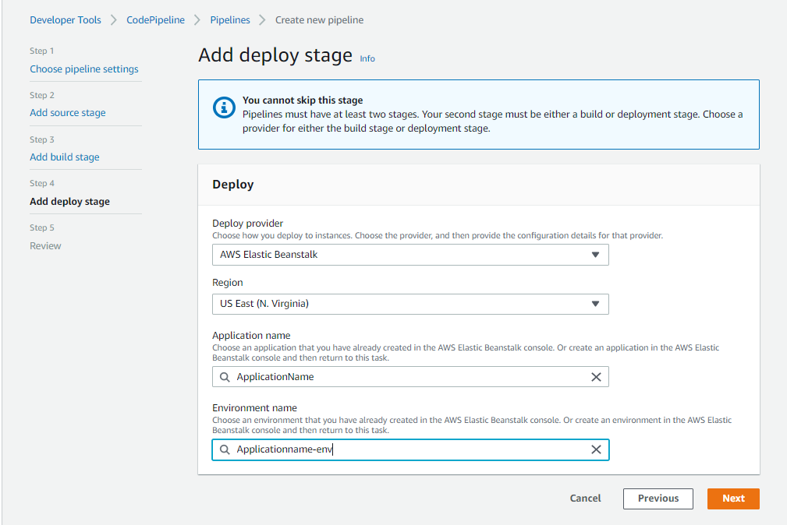

16. Click _create pipeline_. This step may take some time.

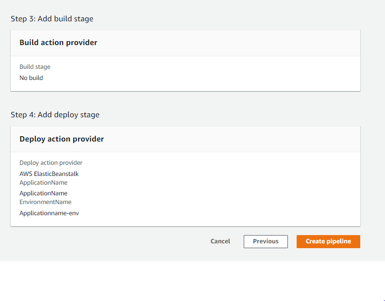

17. if you get green signal **well done**, but if your deploy failed, you should visit _elastic beanstalk environment_ and check the logs.

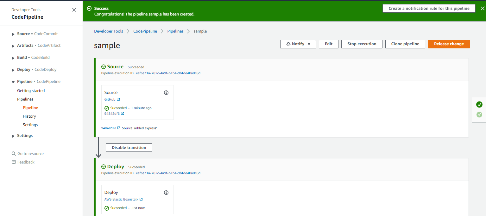.

18. Weather you succeed or failed, in both cases you have to visit _Elastic Beanstalk environment_.

#### In case of success

1. You should visit the _url_ under **Application-env**, you will be able to see your project online.

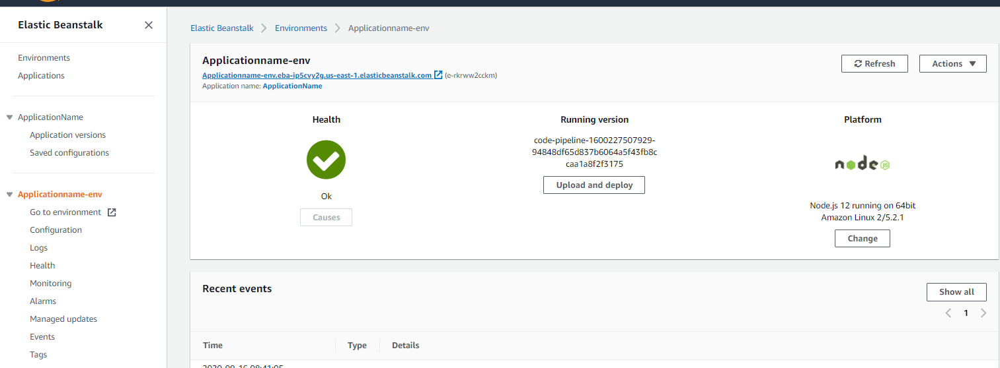.

### In case of failure

1. Check the **logs** tab in left side.
1. Request logs _last 100 logs_ and click _Download_ and debug your project.

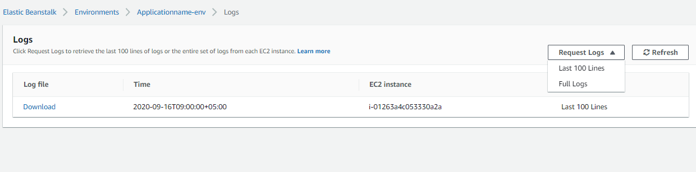

#### Common errors:

AWS deploy automatically runs

```bash
npm install
npm start
```

- You dont need **Procfile** but if you have it recheck its instructions.
- make sure **client/build** folder is in github repo you pushed to github because we skipped _Build Stage_ in AWS pipeline.
- _yarn-lock_ and _package.lock.json_ should not be the part of github project. If you use npm it will not case any error but one project can only have _yarn.lock_ or _package.lock.json_. so add them into **.gitignore** file.
- port can cause error so you should be careful, meaning port should be assigned by AWS first and then your port number like _3000_.

```javascript
const port = process.env.PORT || 3000;
```

- **npm start** should not use _nodemon_.

```javascript
"npm start":"nodemon app.js" wrong
"npm start":"node app.js" right
```

### How to change EC2-instances for Load Balancing and Auto scaling.

1. you can visit _configuration tab_ and choose _capicity_ for changing how many _EC2-servers_ you want, default is min=1, max-4.
   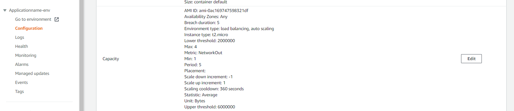.

## ACM and Route 53

- [Route 53](https://www.learningcrux.com/video/aws-lambda-serverless-architecture-bootcamp-build-5-apps/11/14) Watch this video for Route 53.
- [ACM](https://www.learningcrux.com/video/aws-lambda-serverless-architecture-bootcamp-build-5-apps/11/15) Watch this video for Certificate Manager.

## Route 53

1. Select Route 53 in AWS services.
   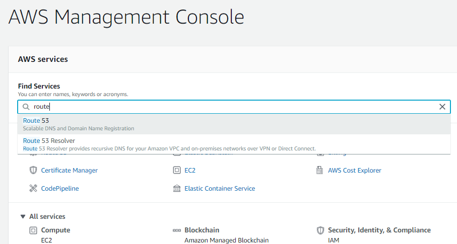

2. Create new _hosted zone_.
3. Write your _domain name_ at right corner.
4. Click _create_.

   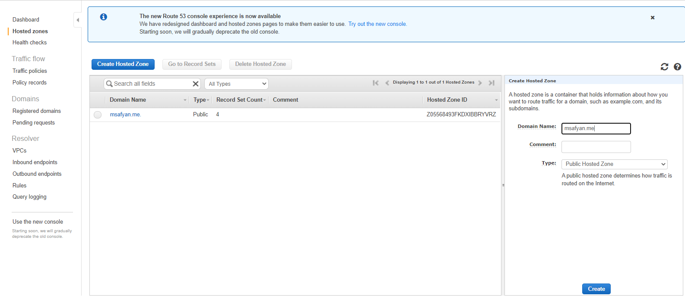

5. Where ever you bought your website like (namecheap,hostgator,name), you have to change nameservers and copy **AWS route 53 NS** and paste them inside hostgator/namecheap NameServers.
6. Do not add **.** at the end

   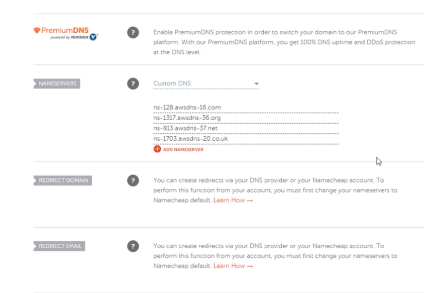

7. now _create Record Set_.
   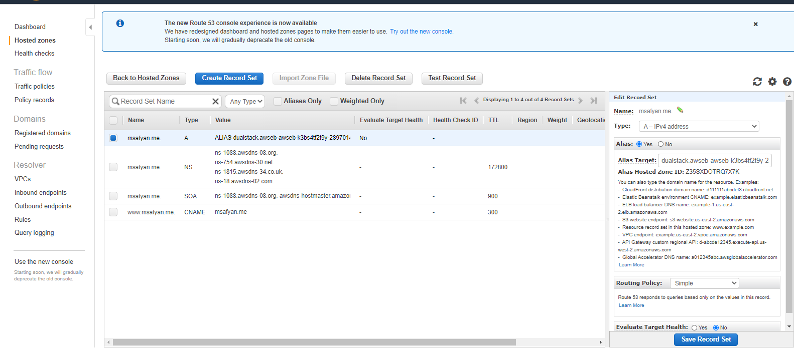

8. Now you have to create record set.
9. leave _Name_ field blank.
10. Alies _yes_.
11. Alies target choose _Elastic beanstalk Environment_ form the dropdown.
12. click _save recode set_.
    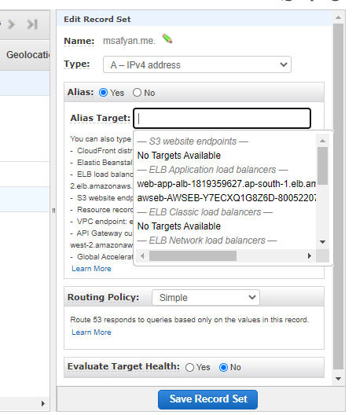

13. create another _record set_.
14. Name _www_.
15. Type _CNAME_.
16. Alias _No_.
17. Value: your domain name without _www_.
18. click _Save record set_.
    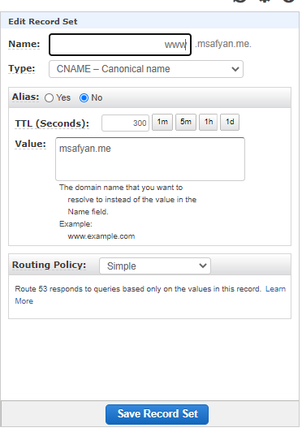

## certificate Manager

1. Write Certificate in AWS services.
   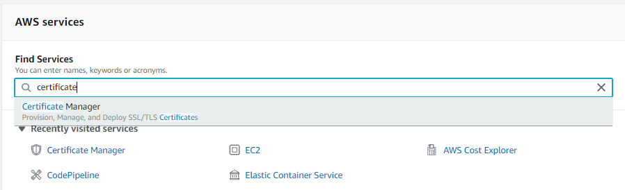

2. Request new certificate.
   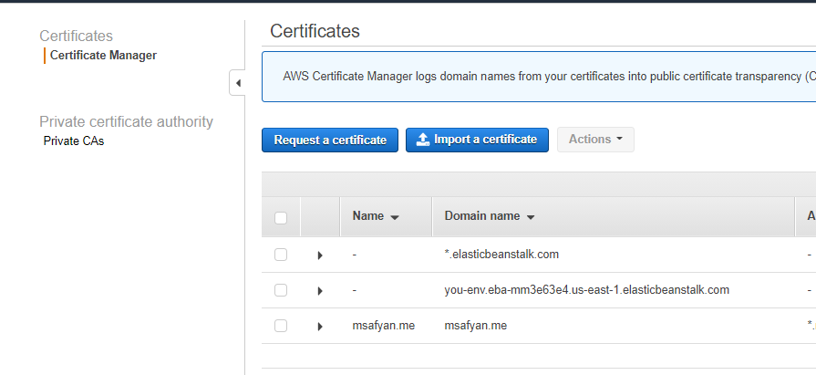

3. Request _public certificate_.
   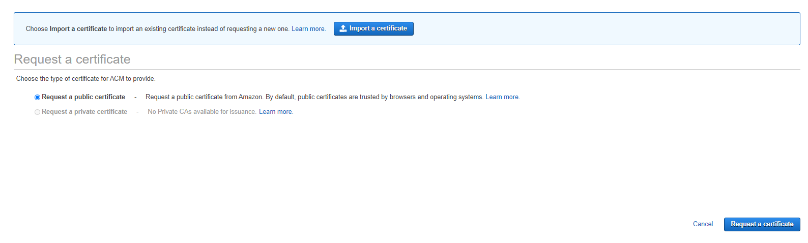

4. Enter your _domain name_
5. _Another domain name_, this is optional.
6. click _next_.
   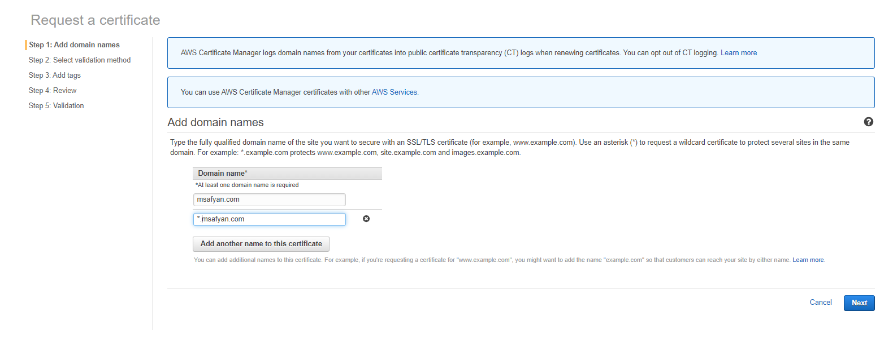

7. click _DNS validation_.
   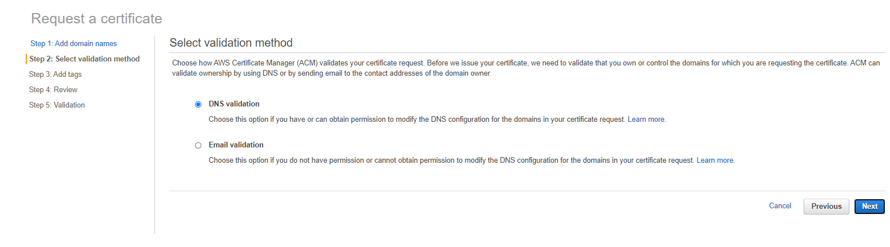

8. you can skip tags.
   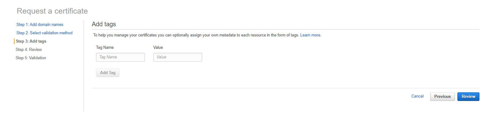

9. Click _confirm and request_.
10. wait for 5-10 mints.
    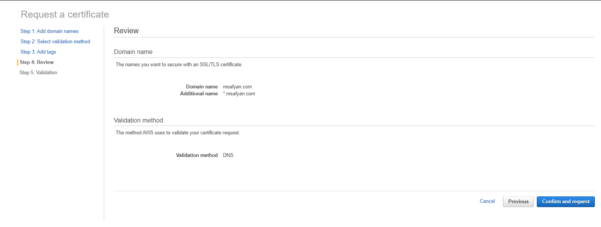
11. click on blue button **create record in Route 53**
    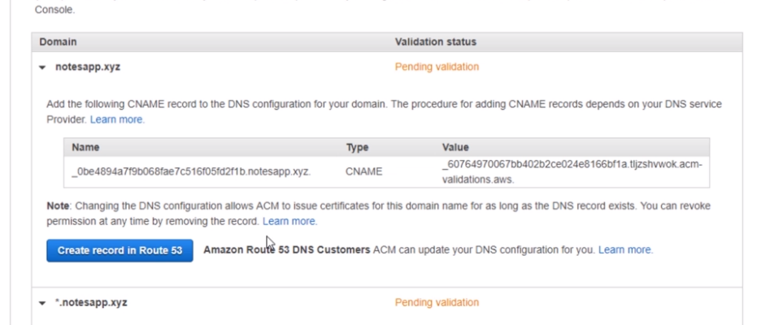

## Now we Need add https to our Load Balancer

[Helpful Artical for HTTPS](https://medium.com/@j_cunanan05/how-to-redirect-http-to-https-in-amazon-web-services-aws-elastic-beanstalk-67f309734e81) please visit this artical for detailed instructions.

1. go to elastic beanStalk evn> configuration> load balancer > add listner
1. port _443_
1. select your certificate
1. process default
1. Click Apply.

   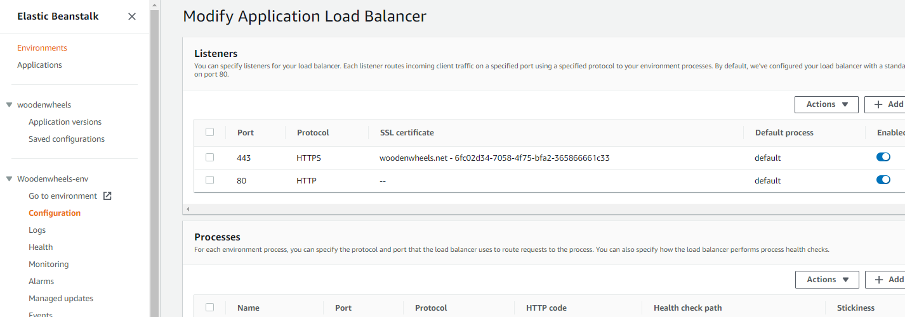

## EC2

### For redirecting http to https

1. EC2> your-elastic-environment-instance> Load-Balancer> Listener
1. select port:80 , delete action and add action
   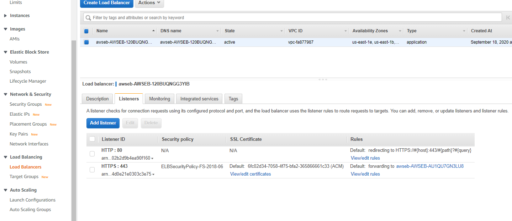
   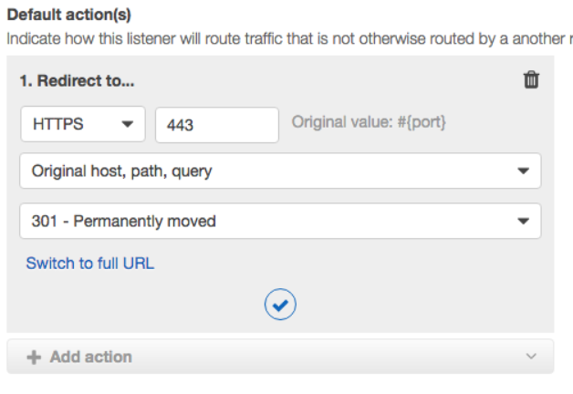

### now visit your domain.

Congratulations
